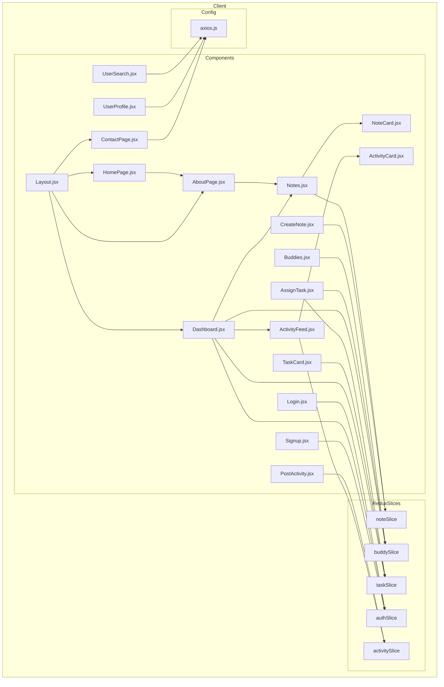

    

    <b>Automatic Architecture Diagrams from Code</b> 
    <a href="https://github.com/swark-io/swark">GitHub</a> • <a href="https://swark.io">Website</a> • <a href="mailto:contact@swark.io">Contact Us</a>

## Usage Instructions

1. **Render the Diagram**: Use the links below to open it in Mermaid Live Editor, or install the [Mermaid Support](https://marketplace.visualstudio.com/items?itemName=bierner.markdown-mermaid) extension.
2. **Recommended Model**: If available for you, use `claude-3.5-sonnet` [language model](vscode://settings/swark.languageModel). It can process more files and generates better diagrams.
3. **Iterate for Best Results**: Language models are non-deterministic. Generate the diagram multiple times and choose the best result.

## Generated Content
**Model**: GPT-4o - [Change Model](vscode://settings/swark.languageModel)  
**Mermaid Live Editor**: [View](https://mermaid.live/view#pako:eNqFVctu2zAQ_BWB56Qf4EMBx0bRQ1EYdXKieqDFtcRWIg0-ChtB_r18iBTXStqLOJzZXVNDDfxKOsWBbEgre80uQ_O8b2XTGHdK290oQNpA1aSaLkp63iShabYn5eyB9UAL-vTLXH9m_buyYGh8Iv7JcS68Mq9I2xojevnMzG-6QFTxYkAfgeluoAtEFaFlxzSnGaz6D1qdxQi0wqjmm-qFpPGJ-D0zw0mF0QUh_aCM3XZW_BH2RusNqtppYBaCL3SB2IW57QsAp_Xm3ar4rvUGVX1VE8RLygCfRUnLunSLFUY1R38N7kLTgn1iN3_xNC2ru4_nyqBSQfK7b-sHcHc9jqIDUw-IDJUZoQ_olsRTgej6k2gzWixzdkgay2hl56zXuw8P7i07i75MuAplKAtP_7q4KS4BlKw0j4-fU0YCHUGhgmNrNp4l0HNyorCYEaeX0PxfLEYFbclS1OKrBD5n6P2OOTy4JeYmUdnkQJfIrEdhCR8aa_-YWKy866jiE9Q6lqigjF1CuXa-noa68419WFBG5BwmNX8N8YeXAGJHU_TWBqTgRT5PvaPR_IqvfupOKe61kjyQCfTEBPf_Fa8tsQNM0JJN0xIOZ-ZG25I3X-Qu3Bu2F8yHYiIbqx08EB8wdbzJLu-1cv1ANmc2Gnj7C_nDMFE) | [Edit](https://mermaid.live/edit#pako:eNqFVctu2zAQ_BWB56Qf4EMBx0bRQ1EYdXKieqDFtcRWIg0-ChtB_r18iBTXStqLOJzZXVNDDfxKOsWBbEgre80uQ_O8b2XTGHdK290oQNpA1aSaLkp63iShabYn5eyB9UAL-vTLXH9m_buyYGh8Iv7JcS68Mq9I2xojevnMzG-6QFTxYkAfgeluoAtEFaFlxzSnGaz6D1qdxQi0wqjmm-qFpPGJ-D0zw0mF0QUh_aCM3XZW_BH2RusNqtppYBaCL3SB2IW57QsAp_Xm3ar4rvUGVX1VE8RLygCfRUnLunSLFUY1R38N7kLTgn1iN3_xNC2ru4_nyqBSQfK7b-sHcHc9jqIDUw-IDJUZoQ_olsRTgej6k2gzWixzdkgay2hl56zXuw8P7i07i75MuAplKAtP_7q4KS4BlKw0j4-fU0YCHUGhgmNrNp4l0HNyorCYEaeX0PxfLEYFbclS1OKrBD5n6P2OOTy4JeYmUdnkQJfIrEdhCR8aa_-YWKy866jiE9Q6lqigjF1CuXa-noa68419WFBG5BwmNX8N8YeXAGJHU_TWBqTgRT5PvaPR_IqvfupOKe61kjyQCfTEBPf_Fa8tsQNM0JJN0xIOZ-ZG25I3X-Qu3Bu2F8yHYiIbqx08EB8wdbzJLu-1cv1ANmc2Gnj7C_nDMFE)

