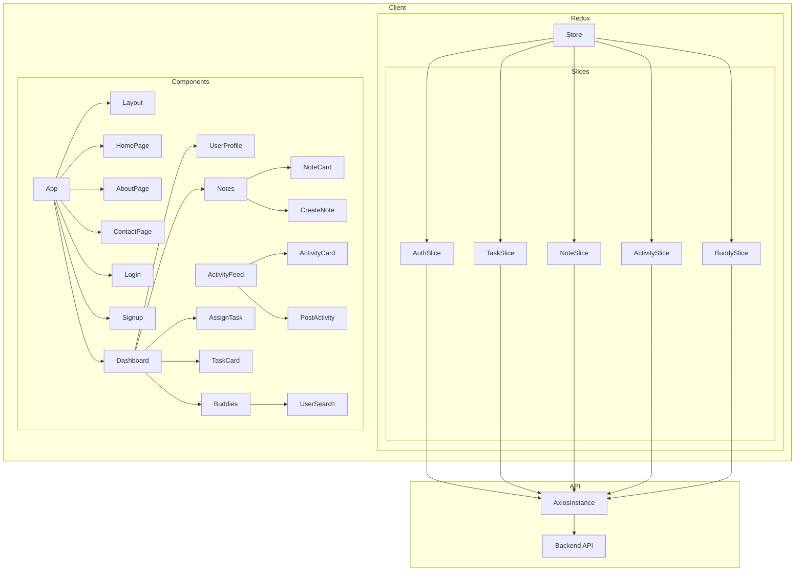

    

    <b>Automatic Architecture Diagrams from Code</b> 
    <a href="https://github.com/swark-io/swark">GitHub</a> • <a href="https://swark.io">Website</a> • <a href="mailto:contact@swark.io">Contact Us</a>

## Usage Instructions

1. **Render the Diagram**: Use the links below to open it in Mermaid Live Editor, or install the [Mermaid Support](https://marketplace.visualstudio.com/items?itemName=bierner.markdown-mermaid) extension.
2. **Recommended Model**: If available for you, use `claude-3.5-sonnet` [language model](vscode://settings/swark.languageModel). It can process more files and generates better diagrams.
3. **Iterate for Best Results**: Language models are non-deterministic. Generate the diagram multiple times and choose the best result.

## Generated Content
**Model**: GPT-4o - [Change Model](vscode://settings/swark.languageModel)  
**Mermaid Live Editor**: [View](https://mermaid.live/view#pako:eNptlc9u4yAQxl_F4ty-QA4rpYlWW2m1iuruCedA7EmMaoNlYNWo6rsv_zxA7EPM8P0GGPhs8kVa2QHZkUbcZjb11fuxEVWlzCV0DwMHoZ2UiW_Qmc-gVVWt5QzUP8-Lhpn1wFtQi1xVe6N7r1GMzom-M_URKEYZ_SM1BIpRRvet5v-4vsfZ816W9WK6LqakEDmIrthV9fz8I5W8RljlGmGJGxPmta1xqiswLCp5IsdJCmsLHux-mqj94UZ-s7s0moYG1V9yhBO7AV0CJPuLzfMII2QHKTRrA83itJa8cUH9E7Wa34SZaGhQPTLVXySbO4oRsr8K5tMsr3wAmsXI3Xkqb7xCzZ0Ut2ps026Usgs7c2gKkbrOwRWxBMUanixBOoMZmAYn0xSm9aKhPwE6mndWGX72vIMZJ6n0AmjeKU6oBja3PU3h-eEdsS-Bf4mC86W2uF6qaHgpZ04_zOyMLqVgc6mhw0HGroeZwVvYu7wFotFbKBm9RRerA_Pz40pbejI57ioztfiG0-BVSm5iSInl4xEECx2L_uEXvj-9xlk_uVTUP1-F0kzgbfXC2g87jMbWDTlnY8J5BRbl5R4LG3BJAeAt9gjwDnsExQ32CNP9VRJfCHkiI8wj4539y_lqiO5hhIbsqoZ0cGVm0A35tklm6qwBR87seYxkp2cDT4QZLeu7aJf-LM2tJ7srGxR8_wfsxy3q) | [Edit](https://mermaid.live/edit#pako:eNptlc9u4yAQxl_F4ty-QA4rpYlWW2m1iuruCedA7EmMaoNlYNWo6rsv_zxA7EPM8P0GGPhs8kVa2QHZkUbcZjb11fuxEVWlzCV0DwMHoZ2UiW_Qmc-gVVWt5QzUP8-Lhpn1wFtQi1xVe6N7r1GMzom-M_URKEYZ_SM1BIpRRvet5v-4vsfZ816W9WK6LqakEDmIrthV9fz8I5W8RljlGmGJGxPmta1xqiswLCp5IsdJCmsLHux-mqj94UZ-s7s0moYG1V9yhBO7AV0CJPuLzfMII2QHKTRrA83itJa8cUH9E7Wa34SZaGhQPTLVXySbO4oRsr8K5tMsr3wAmsXI3Xkqb7xCzZ0Ut2ps026Usgs7c2gKkbrOwRWxBMUanixBOoMZmAYn0xSm9aKhPwE6mndWGX72vIMZJ6n0AmjeKU6oBja3PU3h-eEdsS-Bf4mC86W2uF6qaHgpZ04_zOyMLqVgc6mhw0HGroeZwVvYu7wFotFbKBm9RRerA_Pz40pbejI57ioztfiG0-BVSm5iSInl4xEECx2L_uEXvj-9xlk_uVTUP1-F0kzgbfXC2g87jMbWDTlnY8J5BRbl5R4LG3BJAeAt9gjwDnsExQ32CNP9VRJfCHkiI8wj4539y_lqiO5hhIbsqoZ0cGVm0A35tklm6qwBR87seYxkp2cDT4QZLeu7aJf-LM2tJ7srGxR8_wfsxy3q)

